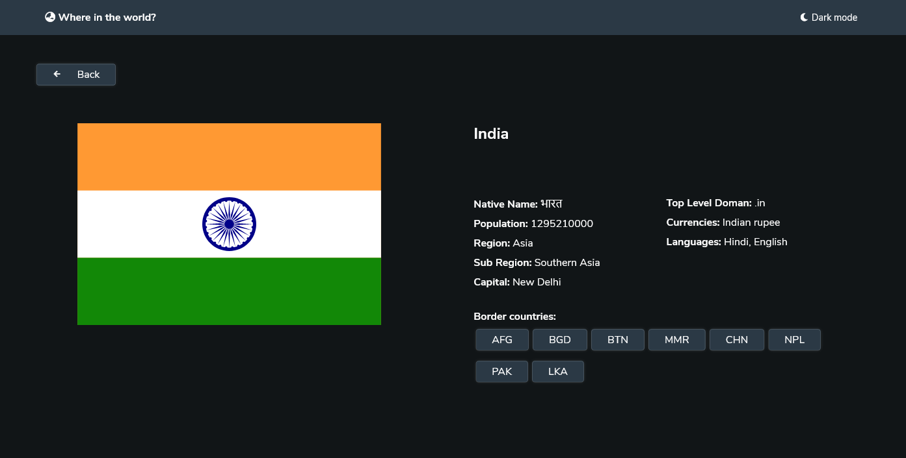

# Frontend Mentor - REST Countries API with color theme switcher solution

This is a solution to the [REST Countries API with color theme switcher challenge on Frontend Mentor](https://www.frontendmentor.io/challenges/rest-countries-api-with-color-theme-switcher-5cacc469fec04111f7b848ca). Frontend Mentor challenges help you improve your coding skills by building realistic projects. 

## Table of contents

- [Overview](#overview)
  - [The challenge](#the-challenge)
  - [Screenshot](#screenshot)
  - [Links](#links)
- [My process](#my-process)
  - [Built with](#built-with)
  - [What I learned](#what-i-learned)
  - [Continued development](#continued-development)
  - [Useful resources](#useful-resources)
- [Author](#author)


## Overview

### The challenge

Users should be able to:

- See all countries from the API on the homepage
- Search for a country using an `input` field
- Filter countries by region
- Click on a country to see more detailed information on a separate page
- Click through to the border countries on the detail page
- Toggle the color scheme between light and dark mode *(optional)*

### Screenshot





### Links

- Solution URL: [my solution](https://github.com/sudarshan2718/rest-countries-api.git)
- Live Site URL: [live site](https://sudarshan2718.github.io/rest-countries-api/)

## My process

### Built with

- Semantic HTML5 markup
- CSS custom properties
- Flexbox
- CSS Grid
- Mobile-first workflow


### What I learned

- infinite scroll
- auto complete
- page redirection

```js
// infinite scroll
window.addEventListener('scroll', async () => {
    if (window.scrollY + window.innerHeight >= document.documentElement.scrollHeight - 1) {
        // load more data
    }
})
```
``` js
// page redirection
window.location = '/index.html'
```

``` js
// auto complete
search_bar.addEventListener('keyup', (event) => {
    while(search_countries.children.length > 0){
        let country = search_countries.children[0];
        country.parentNode.removeChild(country);
    }
    if (country_names  && lettersOnly(event.keyCode) && event.target.value.length > 0) {
        let dropdown_countries = country_names.filter((li) => {
            return li.innerText.toLowerCase().startsWith(event.target.value.toLowerCase());
        })
        try {
            
            for (let i = 0; i < Math.min(7,dropdown_countries.length); i++) {
                search_countries.appendChild(dropdown_countries[i])
            }
        }catch(error){
            console.error(error.message)
        }
        
    }
})
```


### Continued development

- page transition
- format and organize code

### Useful resources

[REST Countries API](https://restcountries.com)


## Author

- Frontend Mentor - [@SUDARSHANVEMARAPU](https://www.frontendmentor.io/profile/SUDARSHANVEMARAPU)
- Twitter - [@Sudarshan2718](https://www.twitter.com/Sudarshan2718)


